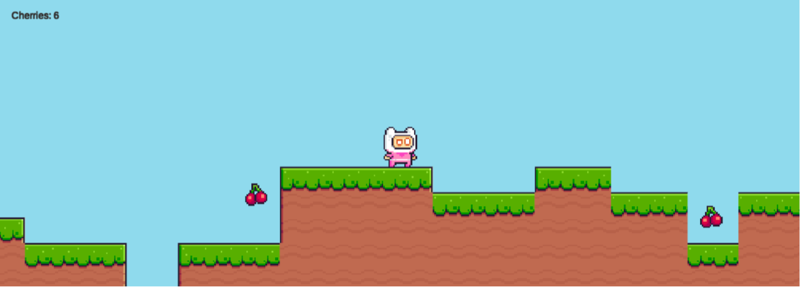

# 🐱🚀 Space Cat Game

**Space Cat Game** adalah proyek game yang dikembangkan menggunakan **Unity**. Pemain mengendalikan seekor kucing luar angkasa dan melewati berbagai tantangan di dalam permainan.

Proyek ini dibuat sebagai media pembelajaran untuk memahami dasar-dasar pengembangan game, seperti pengendalian karakter, interaksi dengan objek, pengaturan scene, penggunaan aset, dan pembuatan mekanisme permainan menggunakan Unity.

---

## 🎮 Tentang Game

Dalam game ini, pemain berperan sebagai seekor kucing yang berada dalam petualangan bertema luar angkasa.

Pemain harus mengendalikan karakter, menghindari berbagai rintangan, dan menyelesaikan tantangan yang tersedia dalam permainan.

Proyek ini berfokus pada penerapan konsep dasar pengembangan game menggunakan Unity dan bahasa pemrograman C#.

---

## ✨ Fitur Utama

* Karakter utama bertema kucing luar angkasa.
* Sistem pergerakan karakter.
* Interaksi antara pemain dan objek permainan.
* Rintangan dan tantangan dalam permainan.
* Penggunaan scene untuk mengatur lingkungan game.
* Tampilan antarmuka permainan.
* Sistem permainan yang dikembangkan menggunakan Unity.
* Aset gambar, animasi, dan audio untuk mendukung pengalaman bermain.

---

## 🛠️ Teknologi yang Digunakan

* **Unity 2021.3.21f1**
* **C#**
* **Unity Editor**
* **Visual Studio**
* **Git**
* **GitHub**

---

## 📁 Struktur Proyek

```text
SpaceCatGame/
│
└── Space Cat Project/
    ├── Assets/
    │   ├── Scenes/
    │   ├── Scripts/
    │   ├── Sprites/
    │   ├── Animations/
    │   ├── Audio/
    │   └── Prefabs/
    │
    ├── Packages/
    ├── ProjectSettings/
    └── UserSettings/
```

Keterangan:

* `Assets` berisi seluruh aset utama yang digunakan dalam game.
* `Scenes` berisi level atau tampilan permainan.
* `Scripts` berisi kode program C#.
* `Sprites` berisi gambar karakter dan objek.
* `Animations` berisi animasi karakter atau objek.
* `Audio` berisi musik dan efek suara.
* `Prefabs` berisi objek yang dapat digunakan kembali.
* `Packages` berisi daftar package Unity yang digunakan.
* `ProjectSettings` berisi konfigurasi proyek Unity.

---

## 🚀 Cara Menjalankan Proyek

### 1. Clone repository

Buka terminal atau Git Bash, lalu jalankan:

```bash
git clone https://github.com/zyraf13/SpaceCatGame.git
```

### 2. Buka Unity Hub

Pastikan perangkat sudah memiliki:

```text
Unity Hub
Unity Editor versi 2021.3.21f1
```

### 3. Tambahkan proyek

Pada Unity Hub:

1. Pilih menu **Open** atau **Add Project**.
2. Cari folder repository yang sudah diunduh.
3. Pilih folder:

```text
Space Cat Project
```

4. Tunggu Unity menyelesaikan proses import aset.

### 4. Jalankan game

Setelah proyek terbuka:

1. Buka folder `Assets`.
2. Cari folder `Scenes`.
3. Buka scene utama.
4. Tekan tombol **Play** di bagian atas Unity Editor.

---

## 🎮 Kontrol Permainan

Kontrol permainan dapat disesuaikan dengan konfigurasi yang digunakan di dalam proyek.

Contoh kontrol umum:

| Tombol       | Fungsi                      |
| ------------ | --------------------------- |
| `A` atau `←` | Bergerak ke kiri            |
| `D` atau `→` | Bergerak ke kanan           |
| `Space`      | Melompat                    |
| `Esc`        | Pause atau keluar dari menu |

---

## 📚 Tujuan Pengembangan

Proyek ini dibuat untuk mempelajari dan menerapkan beberapa konsep berikut:

* Dasar penggunaan Unity Editor.
* Pemrograman game menggunakan C#.
* Pembuatan dan pengaturan scene.
* Pembuatan sistem pergerakan pemain.
* Penggunaan komponen dan GameObject.
* Penggunaan Rigidbody dan Collider.
* Pengelolaan aset game.
* Pembuatan animasi karakter.
* Pembuatan antarmuka pengguna.
* Penggunaan GitHub sebagai media penyimpanan proyek.

---

## 🔧 Pengembangan Selanjutnya

Beberapa fitur yang dapat dikembangkan pada versi berikutnya:

* Menambahkan lebih banyak level.
* Menambahkan sistem skor.
* Menambahkan sistem nyawa atau health.
* Menambahkan musuh dengan kecerdasan sederhana.
* Menambahkan checkpoint.
* Menambahkan menu utama.
* Menambahkan menu pause.
* Menambahkan efek suara dan musik.
* Menambahkan sistem game over.
* Menambahkan sistem penyimpanan progres.
* Membuat versi build untuk Windows atau Android.

---

## 📷 Tampilan Game

 screenshot permainan :

```markdown

```

---

## 📦 Build Game

Untuk membuat game menjadi file aplikasi:

1. Buka menu **File**.
2. Pilih **Build Settings**.
3. Pilih platform yang ingin digunakan.
4. Tambahkan scene utama ke dalam daftar build.
5. Tekan **Build**.
6. Pilih folder penyimpanan hasil build.

Platform yang dapat digunakan antara lain:

* Windows
* Linux
* macOS
* Android
* WebGL

---

## 👨‍💻 Pengembang

**Salman Alfaris**

* GitHub: [zyraf13](https://github.com/zyraf13)
* LinkedIn: [Salman Alfaris](https://www.linkedin.com/in/salman-alfaris-106557296/)

---

## 📄 Lisensi

Proyek ini dibuat untuk tujuan pembelajaran dan pengembangan portofolio.

Aset pihak ketiga yang digunakan dalam proyek tetap mengikuti ketentuan lisensi dari masing-masing pemilik aset.

---

⭐ Berikan tanda bintang pada repository ini apabila proyeknya bermanfaat.
